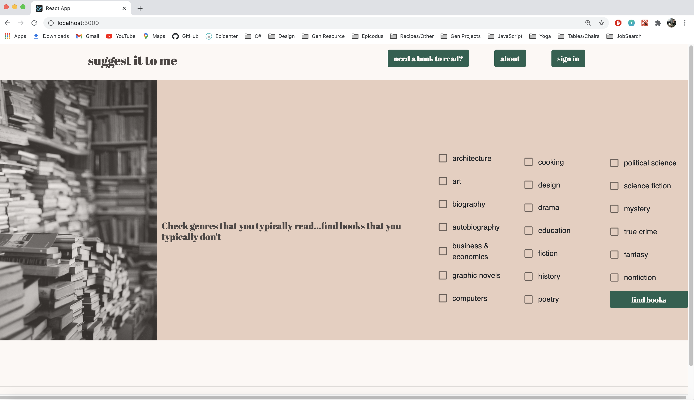
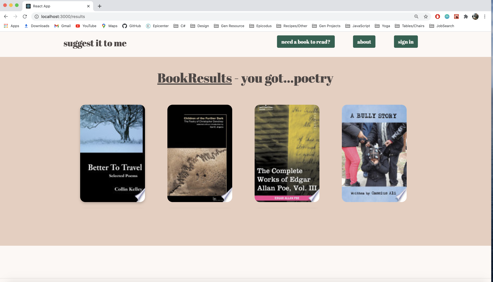
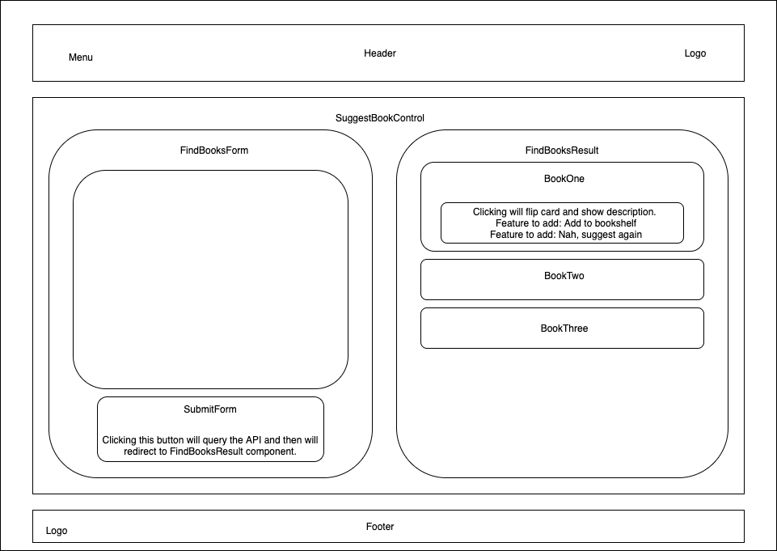

# Suggest It To Me

### Console application using JavaScript with React that will attempt to expand a readers horizons by suggesting books they aren't typically inclined to read. 

### Built: December 10th, 2020, updated December 23rd, 2020

#### <a href="https://github.com/chloehellberg">Created By: Chloe Hellberg</a> 


------------------------------
### <u>Table of Contents</u>
* <a href="#🌐-about-the-project">About the Project</a>
    * <a href="#📖-description">Description + Capstone Proposal + Components Diagram</a>
    * <a href="#🦠-known-bugs">Known Bugs</a>
    * <a href="#🛠-built-with">Built With</a>
* <a href="#🏁-getting-started">Getting Started</a>
    * <a href="#📋-prerequisites">Prerequisites</a>
    * <a href="#⚙️-setup-and-use">Setup and Use</a>
* <a href="#🤝-contributors">Auxiliary</a>
    * <a href="#🤝-contributors">Contributors</a>
    * <a href="#✉️-contact-and-support">Contact</a>
    * <a href="#⚖️-license">License</a>
    
------------------------------

## 🌐 About the Project

### 📖 Description


- Inspiration Behind Project:
  - When I was in college I registered for an English class expecting to read the classics but isntead got an entire course devoted to utopian/dystopian science fiction. I expected to hate it and drop since I had never read any sci-fi in my life - no one had ever suggested this particular genre to me before. Of course what ended up happening was an awakening and science fiction is now counted as one of my favorite genres and thus the catalyst for this project.
- Project Purpose or Goal:
  - What I love most about reading is that I can dive into perspectives of all different kinds of people and types of places and hopefully gain better understanding of others who aren't me. It's not helpful though when the only books suggested to me keep me in the same lane and don't allow me to expand my horizons. I'm also tired of having my Google footprint follow me around wherever I go and determine what I may like or not based on my previous experiences. I'm setting out to build the opposite of a "Books Suggested For You" application - more of a, "Books Not Typically Suggested For You" website. Perhaps there is a book or genre out there that you've never considered and no one else has thought to suggest it to you either - until now!

  <br />
  <br />
  
  <br />
  <br />
  

### Capstone Proposal
- Name of Project: "Suggest It To Me" 

- MVP (Minimum Viable Product):
  - Users can go to a suggestion form, choose a few genres they typically like (ex. Historical Fiction, Adventure, Mystery) and product will spit out three book suggestions that doln't fall within those categories
  - Or, Users go to a suggestion form, choose a genre they would like to explore (ex. Historical Fiction, Adventure, Mystery) and how many books they would like suggested. On submit, form pulls the genre keyword and then spits out say Mystery novels that are all vastly different based on keywords.
  - Suggestion form may work as guided flow that splits off paths and goes one way or another depending on what was previously chosen. Rather than having a one page entry form.

- What tools, frameworks, libraries, APIs, modules and/or other resources that will be utilized to create the MVP:
  - Framework/Language: JavaScript/React/Redux
  - Google API for pulling book information

- If finished with MVP, additional features to work on:
  - Authorization/Authentication abilities
    * User will be able to keep track of books they've previously read (a bookshelf feature).
    * User will be able to continuously base their suggestions off of what they've previously read.
  - More than one suggestion at a time
    * User can choose how many book suggestions they want at a time rather than a static 3 options.
    * User also has ability to say "no" to a book and have another suggestion pop up.
  - User can enter books they've previously read on the form and will take those into consideration when suggesting books to read.
  - Add an option to choose book size/length as a parameter search. Additional filter options.

- What additional tools, frameworks, libraries, APIs or other resources to achieve addtional features:
  - Goodreads API for pulling in previous books read.
  - Firebase if I add authorization/authentication features.


### Suggest It To Me Components Diagram




### 🦠 Known Bugs

* No known bugs at this time. <a href="https://github.com/chloehellberg/SuggestItToMe/issues">Please report if you discover any.</a>

### 🛠 Built With
* [React](https://reactjs.org/)
* [Visual Studio Code](https://code.visualstudio.com/)
* [HTML5](https://html.com/html5/)
* [Markdown](https://daringfireball.net/projects/markdown/)

------------------------------

## 🏁 Getting Started

### 📋 Prerequisites

### Interactive Development Environment

  &emsp;To view or edit the document which may include some HTML code, you will need an code editor or text editor. The popular open-source choices for an code editor are Atom and VisualStudio Code.

  1) Code Editor Download:
     * Option 1: [Atom](https://nodejs.org/en/)
     * Option 2: [VisualStudio Code](https://www.npmjs.com/)
  2) Click the download most applicable to your OS and system.
  3) Wait for download to complete, then install -- Windows will run the setup exe and macOS will drag and drop into applications.
  4) Optionally, create a [GitHub Account](https://github.com)

### ⚙️ Setup and Use

  #### Cloning

  1) Click 'Clone or download' to reveal the HTTPS url ending with .git and the 'Download ZIP' option.
  2) Open up your system Terminal or GitBash, navigate to your desktop with the command: `cd Desktop`, or whichever location suits you best.
  3) Clone the repository to your desktop: `$ git clone https://github.com/chloehellberg/SuggestItToMe`
  4) Run the command `cd suggest-it-to-me` to enter into the project directory.
  5) View or Edit:
      * Code Editor - Run the command `atom .` or `code .` to open the project in Atom or VisualStudio Code respectively for review and editing.
      * Text Editor - Open by double clicking on any of the files to open in a text editor.
  6) In the project directory (suggest-it-to-me), type `npm install` to download dependencies. After they install, type `npm start` to run the application in development mode.  Open [http://localhost:3000](http://localhost:3000) to view it in the browser. Page will reload if you make edits. You will also see any lint errors in the console.


#### Learn More
  - This project was bootstrapped with [Create React App](https://github.com/facebook/create-react-app).
  - You can learn more in the [Create React App documentation](https://facebook.github.io/create-react-app/docs/getting-started).
  - To learn React, check out the [React documentation](https://reactjs.org/).

------------------------------

### 🤝 Contributors

| Author | GitHub | Email |
|--------|:------:|:-----:|
| [Chloe Hellberg](https://linkedin.com/in/chloehellberg) | [chloehellberg](https://github.com/chloehellberg) |  [chloe.hellberg@gmail.com](mailto:chloehellberg@gmail.com) |


------------------------------

### ✉️ Contact and Support

If you have any feedback or concerns, please contact me!

------------------------------

### Helpful Resources
- Google Books API : https://developers.google.com/books
- Goodreads API : https://www.goodreads.com/api/documentation
- Youtube on React Router: https://www.youtube.com/watch?v=Law7wfdg_ls&ab_channel=DevEd
- On multi-filtering: https://medium.com/better-programming/creating-a-multi-filter-function-to-filter-out-multiple-attributes-javascript-react-rails-5aad8e272142
- About React-Router: https://dev.to/projectescape/programmatic-navigation-in-react-3p1l
- Material UI checkboxes: https://material-ui.com/api/checkbox/
- Book Genres: https://bisg.org/page/bisacedition
- Another project utilizing Google API: https://github.com/liyasthomas/books

------------------------------

### ⚖️ License

This project is licensed under the [MIT License](https://opensource.org/licenses/MIT). Copyright (C) 2020 Chloe Hellberg. All Rights Reserved.
```
MIT License

Permission is hereby granted, free of charge, to any person obtaining a copy
of this software and associated documentation files (the "Software"), to deal
in the Software without restriction, including without limitation the rights
to use, copy, modify, merge, publish, distribute, sublicense, and/or sell
copies of the Software, and to permit persons to whom the Software is
furnished to do so, subject to the following conditions:

The above copyright notice and this permission notice shall be included in all
copies or substantial portions of the Software.

THE SOFTWARE IS PROVIDED "AS IS", WITHOUT WARRANTY OF ANY KIND, EXPRESS OR
IMPLIED, INCLUDING BUT NOT LIMITED TO THE WARRANTIES OF MERCHANTABILITY,
FITNESS FOR A PARTICULAR PURPOSE AND NONINFRINGEMENT. IN NO EVENT SHALL THE
AUTHORS OR COPYRIGHT HOLDERS BE LIABLE FOR ANY CLAIM, DAMAGES OR OTHER
LIABILITY, WHETHER IN AN ACTION OF CONTRACT, TORT OR OTHERWISE, ARISING FROM,
OUT OF OR IN CONNECTION WITH THE SOFTWARE OR THE USE OR OTHER DEALINGS IN THE
SOFTWARE.
```
------------------------------

<center><a href="#">Return to Top</a></center>